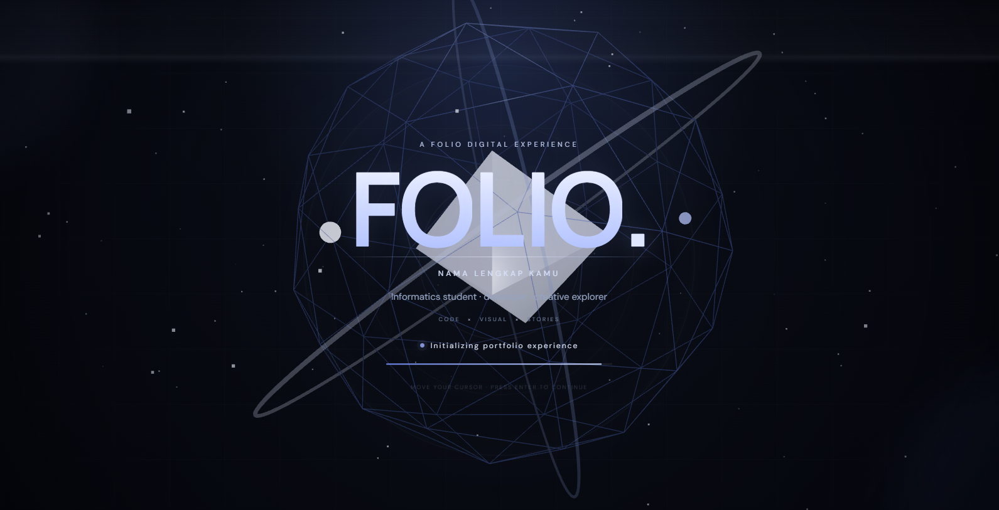
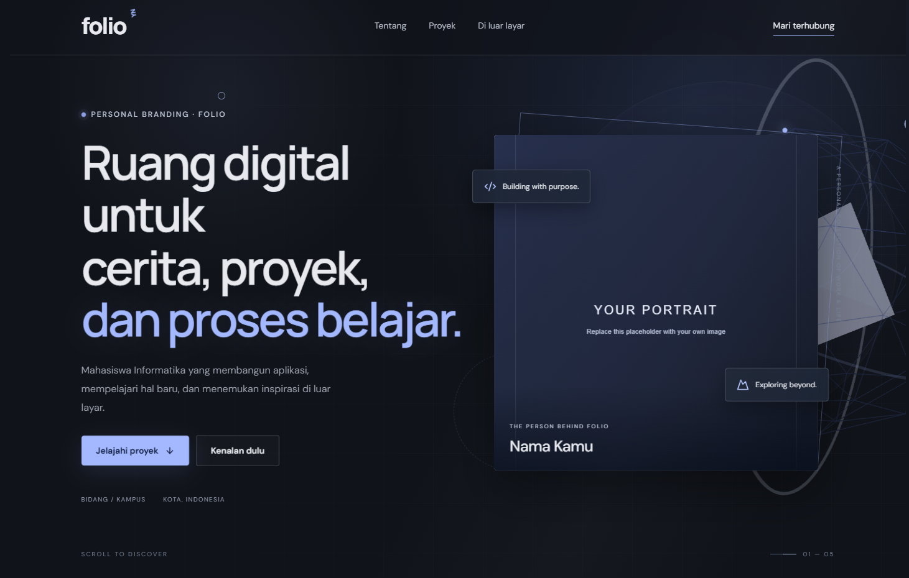
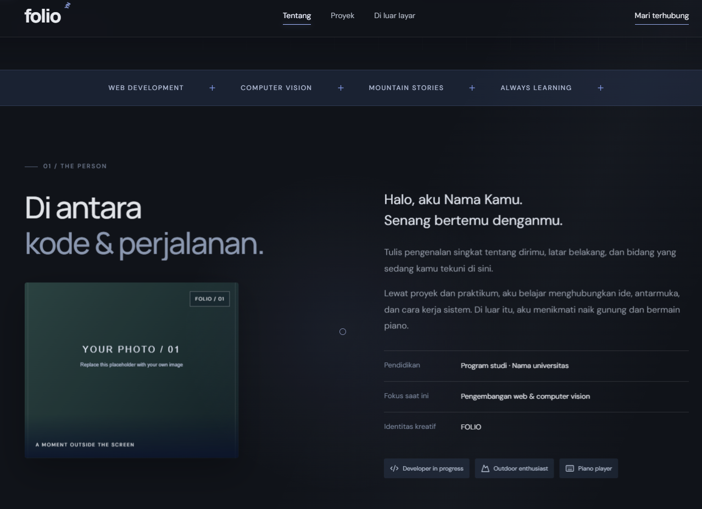
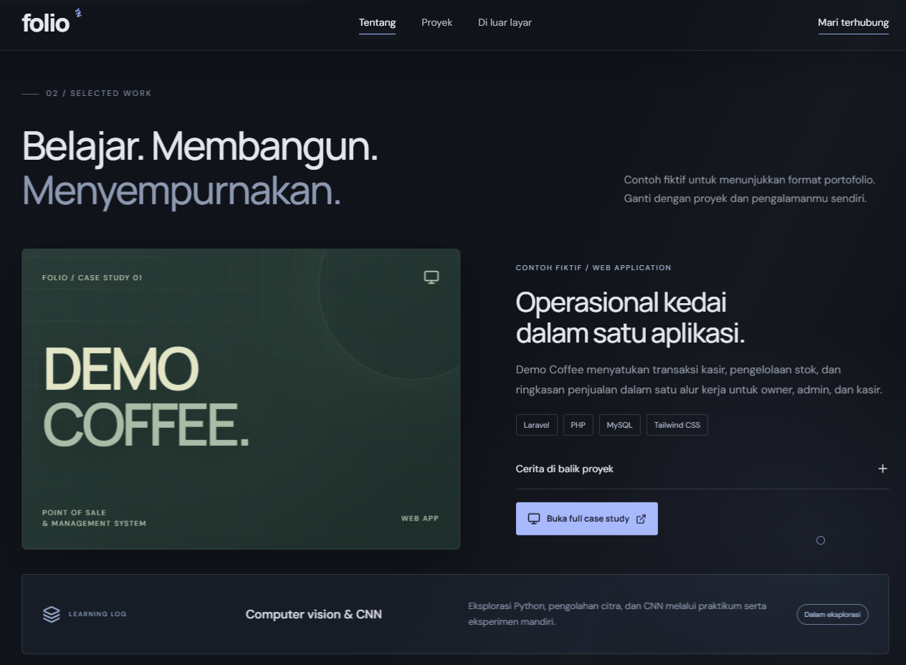
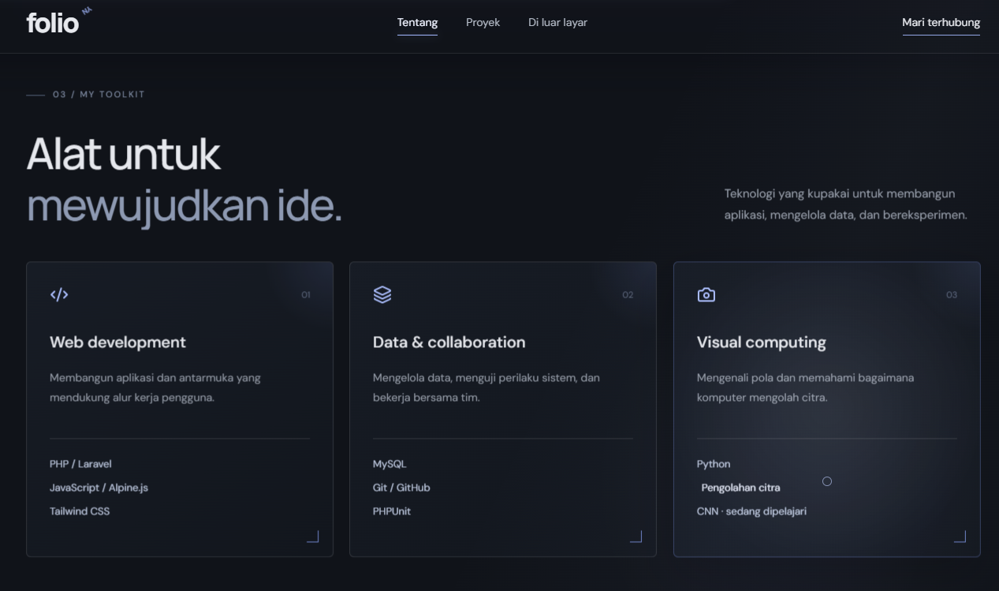
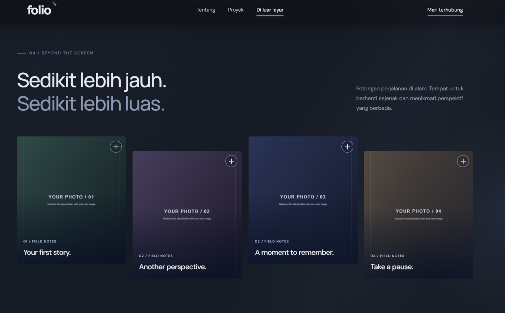
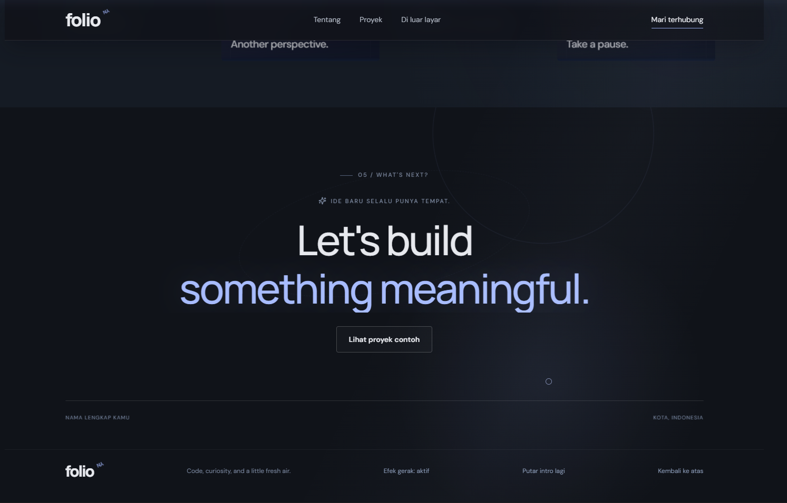

# Cinematic 3D Portfolio Template

A cinematic and interactive portfolio template built for developers, designers, students, and creative explorers who want something more immersive than a conventional portfolio.

The template combines editorial layouts, subtle motion, interactive elements, and a Three.js powered opening experience.

> Replace the demo identity, projects, photos, and stories with your own content.

---

## Overview

This project is designed as a portfolio experience rather than a simple collection of links.

It includes:

- Cinematic intro experience
- Interactive 3D visual elements
- Editorial dark interface
- Animated navigation
- Personal introduction section
- Featured project / case study
- Technology toolkit section
- Personal story / photo gallery
- Interactive project cards
- Responsive layout
- Reduced-motion support
- GitHub repository integration
- Production-ready Vite build

---

## Preview

### Cinematic Intro



The opening experience introduces the portfolio with animated geometry, orbital motion, and a cinematic visual identity.

### Hero Experience



A large editorial hero section combines personal branding, interactive motion, and a visual portrait area.

### About



The about section presents identity, education, current focus, and personal interests.

### Featured Project



A case-study layout for presenting a featured web application, technology stack, repository, and project story.

### Toolkit



Technologies and areas of exploration are presented through structured interactive cards.

### Beyond the Screen



A visual storytelling area for photography, travel, outdoor activities, music, or other personal interests.

### Closing Experience



The final section provides a clean closing statement, GitHub call-to-action, and replay controls.

---

## Tech Stack

```text
React
TypeScript
Vite
Three.js
CSS
Git / GitHub
```

The project separates the main application from larger React and Three.js vendor bundles during production builds.

---

## Getting Started

Clone the repository:

```bash
git clone https://github.com/Satar2007/cinematic-3d-portfolio-template.git
```

Enter the project directory:

```bash
cd cinematic-3d-portfolio-template
```

Install dependencies:

```bash
npm install
```

Start the development server:

```bash
npm run dev
```

Vite will display the local development address, usually:

```text
http://localhost:5173
```

---

## Production Build

Create a production build:

```bash
npm run build
```

Preview the production build locally:

```bash
npm run preview
```

The generated production files will be placed in:

```text
dist/
```

---

## Customization

The template intentionally ships with placeholder content.

### Identity

Open:

```text
src/content.ts
```

This is the main place to replace:

```text
Brand
Initials
Full name
Display name
Location
Education
Short bio
Repository URL
Portrait
About image
Gallery content
```

Example:

```ts
export const profile = {
  brand: 'FOLIO',
  initials: 'YN',
  fullName: 'NAMA LENGKAP KAMU',
  displayName: 'Nama Kamu',
  location: 'KOTA, INDONESIA',
};
```

Replace the values without changing the object structure.

---

## Photos

Default placeholder images are located in:

```text
public/photos/
```

You can replace them with your own images.

The template currently provides placeholders for:

```text
Portrait
About photo
Journey photo
Horizon photo
Night photo
Pause photo
```

For better performance, optimize large images before adding them to the project.

Recommended formats:

```text
WebP
AVIF
JPEG
PNG
SVG
```

---

## Featured Project

The default featured project is intentionally fictional.

It exists to demonstrate how a portfolio case study can be presented.

Replace the demo project with your own:

```text
Project title
Project description
Problem
Solution
Technology stack
Repository URL
Case study
Screenshots
```

Some longer portfolio copy and case-study content currently live in:

```text
src/main.tsx
```

---

## Gallery

The "Beyond the Screen" section is designed for content outside your main technical work.

You can use it for:

```text
Photography
Travel
Outdoor activities
Art
Music
Personal projects
Research
Experiments
Stories
```

Gallery metadata can be edited from:

```text
src/content.ts
```

---

## Project Structure

```text
cinematic-3d-portfolio-template/
|
|-- public/
|   |-- photos/
|   |-- favicon.svg
|   `-- site.webmanifest
|
|-- src/
|   |-- content.ts
|   |-- main.tsx
|   `-- style.css
|
|-- index.html
|-- package.json
|-- package-lock.json
|-- tsconfig.json
`-- README.md
```

The structure may evolve as new components and 3D experiences are added.

---

## Design Direction

The interface follows a dark cinematic and editorial visual language.

Core characteristics include:

```text
Dark charcoal surfaces
Large typography
Soft blue accents
Generous spacing
Geometric visual elements
Subtle motion
Interactive depth
Minimal interface decoration
```

The goal is to create a portfolio that feels immersive without making navigation difficult.

---

## Motion and Interaction

The template uses motion as part of the experience.

Animations are designed to support the interface rather than distract from the content.

The experience includes:

```text
Intro animation
Cursor interaction
Scroll-based transitions
Hover interaction
Animated project elements
3D geometry
Decorative orbital motion
```

Reduced-motion preferences are also considered.

---

## Performance

3D experiences can become expensive to render, so performance should remain part of the design process.

When expanding this template, consider:

```text
Compressing textures
Optimizing 3D geometry
Lazy loading heavy assets
Using compressed GLB models
Reducing unnecessary lighting
Avoiding oversized textures
Testing on mobile hardware
Using dynamic imports where useful
```

A large Three.js bundle warning during a production build is not necessarily a build failure, but further code splitting can be added as the project grows.

---

## Deployment

Because this is a Vite application, the generated static site can be deployed to services such as:

```text
Vercel
Netlify
Cloudflare Pages
GitHub Pages
```

For Vercel, the usual workflow is:

```text
Local project
    |
    v
Git repository
    |
    v
GitHub
    |
    v
Vercel
    |
    v
Production site
```

Build command:

```bash
npm run build
```

Output directory:

```text
dist
```

---

## Before Publishing Your Own Portfolio

Replace all demo content before using the template as your personal portfolio.

Search the project for strings such as:

```text
Nama Kamu
NAMA LENGKAP KAMU
YOUR PORTRAIT
YOUR PHOTO
Demo Coffee
Contoh fiktif
KOTA, INDONESIA
```

This helps make sure no placeholder content is left behind.

---

## Roadmap

Future ideas for the template include:

- More modular React components
- Dedicated project detail pages
- Advanced camera transitions
- Interactive 3D room environment
- GLTF / GLB model support
- Improved mobile 3D fallback
- More theme controls
- Better content configuration
- Image optimization workflow
- Additional accessibility improvements
- Performance-oriented code splitting

---

## Inspiration

The concept combines:

```text
Code
Visual design
Motion
3D interaction
Personal storytelling
```

The objective is simple:

**Make a portfolio feel like an experience, not just a page.**

---

## Author

Created and developed by:

**Rafael Paskah Bintang Pinasthi**

GitHub:

https://github.com/Satar2007

---

## Notes

This repository is provided as a customizable portfolio template.

Demo names, photographs, project descriptions, and personal information inside the template are placeholders and are intended to be replaced by the user.